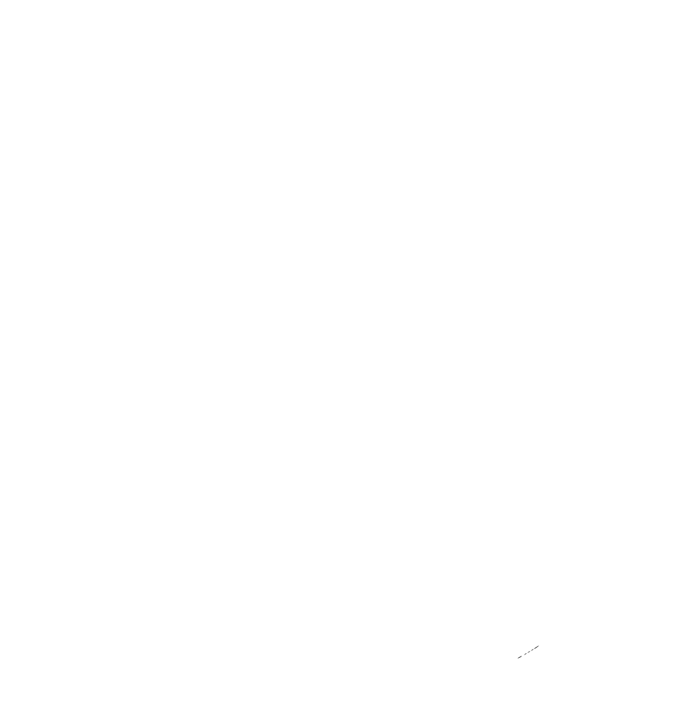

<div align=center>

![views] ![stars] ![forks] ![issues] ![license] ![repo-size]

<picture>
  <source media="(prefers-color-scheme: dark)" srcset="./public/nextjs-light.svg">
  <source media="(prefers-color-scheme: light)" srcset="./public/nextjs-dark.svg">
  
</picture>

# Next.js Starter Template

A minimal Next.js starter with **Next.js 16**, **Tailwind CSS v4**, **TypeScript**, **ESLint 10** (flat config), **Prettier**, and **Husky**.

</div>

## Features

- **Next.js 16** – App Router, Turbopack, React Compiler (prod)
- **Tailwind CSS v4** – CSS-first config (`@theme` in `globals.css`)
- **TypeScript** – Strict mode
- **ESLint 10** – Flat config with Next, TypeScript, Prettier, React Compiler
- **Prettier** – Import sort + Tailwind class sorting
- **Husky + lint-staged** – Pre-commit: ESLint + Prettier on staged files

## Prerequisites

Node.js ≥ 20.9.0

## Getting Started

```bash
bunx create-next-app -e "https://github.com/Khushal-ag/nextjs-template" <project-name>
```

**Install dependencies**

```bash
bun i
# or: pnpm i | yarn | npm i
```

**Initialize git _(optional)_**

```bash
git init
git add .
git commit -m "init"
```

Husky runs on install (`prepare`) and sets up the pre-commit hook.

## Available Scripts

| Script       | Description                                  |
| ------------ | -------------------------------------------- |
| `dev`        | Start dev server (Turbopack)                 |
| `build`      | Production build                             |
| `start`      | Serve production build                       |
| `preview`    | Build and serve (production mode)            |
| `lint`       | ESLint + TypeScript type-check               |
| `lint:fix`   | ESLint with auto-fix                         |
| `type-check` | TypeScript type-check only                   |
| `fmt:check`  | Check Prettier formatting                    |
| `fmt`        | Format with Prettier                         |
| `validate`   | `lint` + `fmt:check` + `build` (for CI)      |
| `ui`         | Shadcn UI CLI                                |
| `clean`      | Remove `.next` cache                         |
| `cleani`     | Remove `.next` and `node_modules`, reinstall |

## Project Structure

- `src/app/` – App Router (layout, page, robots, sitemap)
- `src/components/` – React components
- `src/config/site.ts` – Site config (SEO, links, metadata)
- `src/lib/` – Utilities, fonts
- `src/styles/globals.css` – Global styles + Tailwind `@theme`

## Customization

Edit **`src/config/site.ts`** for your project:

- `name`, `description`, `url`, `keywords`
- `authors`, `creator`, `links` (repo, github, social)
- `twitter`, `ogImage`, `robots`

Set **`NEXT_PUBLIC_SITE_URL`** in `.env` to override the base URL (e.g. per environment). See `.env.example`.
If you use remote images with `next/image`, set **`NEXT_PUBLIC_IMAGE_HOSTS`** (comma-separated hostnames, `https` only), for example: `images.example.com,cdn.example.org`.

Metadata, Open Graph, Twitter, sitemap, and robots all use this config.

## After Installation

- [ ] Update `package.json` with your project details
- [ ] Update `README.md` and `LICENSE`
- [ ] Edit `src/config/site.ts`
- [ ] Replace or edit `src/app/page.tsx` and `src/app/layout.tsx`
- [ ] Remove or repurpose `src/app/client-components.tsx` if not needed

## Switching Package Manager

The template uses [bun](https://bun.sh/) and keeps `bun.lock`. To use npm, yarn, or pnpm: remove `bun.lock`, then run `npm i`, `yarn`, or `pnpm i`. Other lockfiles are in `.gitignore`.
`validate` is package-manager agnostic, so `npm run validate`, `pnpm validate`, `yarn validate`, and `bun run validate` all work.

## License

MIT – see [LICENSE](LICENSE).

## Contributors

<div align=center>

[![][contributors]][contributors-graph]

_It may take up to 24h for the [contrib.rocks][contrib-rocks] plugin to update._

</div>

[views]: https://komarev.com/ghpvc/?username=nextjs-template&label=view%20counter&color=red&style=flat
[repo-size]: https://img.shields.io/github/repo-size/Khushal-ag/nextjs-template
[issues]: https://img.shields.io/github/issues-raw/Khushal-ag/nextjs-template
[license]: https://img.shields.io/github/license/Khushal-ag/nextjs-template
[forks]: https://img.shields.io/github/forks/Khushal-ag/nextjs-template?style=flat
[stars]: https://img.shields.io/github/stars/Khushal-ag/nextjs-template
[contributors]: https://contrib.rocks/image?repo=Khushal-ag/nextjs-template&max=500
[contributors-graph]: https://github.com/Khushal-ag/nextjs-template/graphs/contributors
[contrib-rocks]: https://contrib.rocks/preview?repo=Khushal-ag%2Fnextjs-template
